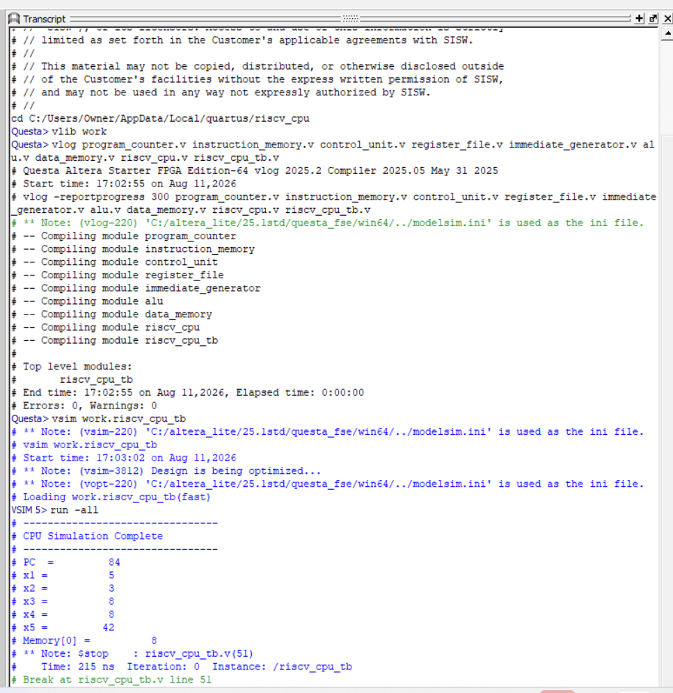
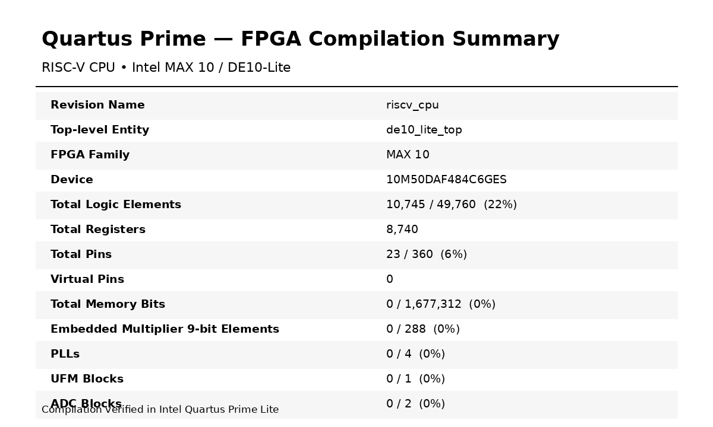

# 32-bit RISC-V CPU in Verilog

A synthesizable 32-bit RISC-V processor implemented in Verilog and developed for FPGA deployment on the Intel DE10-Lite platform. The design uses a modular single-cycle datapath with instruction decode, register-file access, immediate generation, ALU execution, data memory access, writeback, and conditional branch control.

The processor was developed using Intel Quartus Prime and verified through module-level and integrated simulation using Questa.

## Architecture

The processor is organized as a modular single-cycle datapath:

```text
              +--------------------+
              |  Program Counter   |
              +---------+----------+
                        |
                        v
              +--------------------+
              | Instruction Memory |
              +---------+----------+
                        |
                        v
        +---------------+----------------+
        |                                |
        v                                v
+---------------+                +--------------------+
| Control Unit  |                | Immediate Generator|
+-------+-------+                +---------+----------+
        |                                  |
        v                                  |
+--------------------+                     |
|   Register File    |                     |
|  32 x 32-bit regs  |                     |
+---------+----------+                     |
          |                                |
          +---------------+----------------+
                          |
                          v
                    +-----------+
                    |    ALU    |
                    +-----+-----+
                          |
                +---------+---------+
                |                   |
                v                   v
        +---------------+      Branch Logic
        |  Data Memory  |           |
        +-------+-------+           |
                |                   |
                v                   |
        +---------------+           |
        |   Writeback   |           |
        +-------+-------+           |
                |                   |
                +----> Register File|
                                    |
                                    v
                              Program Counter
```

## Features

- 32-bit RISC-V datapath
- Modular Verilog RTL design
- 32 × 32-bit register file with x0 hardwired to zero
- Arithmetic, logical, comparison, and shift operations
- Immediate generation for I-, S-, B-, U-, and J-type instruction formats
- Load/store data-memory interface
- Conditional branch control using BEQ
- 256 × 32-bit instruction memory
- 256 × 32-bit data memory
- Synthesizable RTL targeting the Intel DE10-Lite FPGA
- Simulation and verification using Questa
- Successful full FPGA compilation in Intel Quartus Prime

## Implemented Instructions

The current control logic implements the following instruction subset:

| Type | Instructions |
| --- | --- |
| R-Type | ADD, SUB, AND, OR, XOR, SLT, SLL, SRL |
| I-Type | ADDI, ANDI, ORI, XORI, SLTI, SLLI, SRLI |
| Memory | LW, SW |
| Branch | BEQ |

The ALU implements signed comparison for SLT/SLTI and uses the lower five bits of the shift operand for 32-bit shift operations.

## RTL Modules

| Module | Function |
| --- | --- |
| `riscv_cpu.v` | Top-level datapath and module integration |
| `program_counter.v` | Stores and updates the current program counter |
| `instruction_memory.v` | Stores the program executed by the processor |
| `control_unit.v` | Decodes instructions and generates control signals |
| `register_file.v` | Implements 32 general-purpose 32-bit registers |
| `immediate_generator.v` | Generates sign-extended instruction immediates |
| `alu.v` | Performs arithmetic, logic, comparison, and shift operations |
| `data_memory.v` | Implements load/store data memory |
| `riscv_cpu_tb.v` | Integrated processor testbench |

## Verification

The integrated processor was simulated with a test program that exercises arithmetic, register writeback, memory operations, and conditional branching.

### Test Program

```text
addi x1, x0, 5
addi x2, x0, 3
add  x3, x1, x2
sw   x3, 0(x0)
lw   x4, 0(x0)
beq  x3, x4, +8
addi x5, x0, 99    # skipped when branch is taken
addi x5, x0, 42
nop
```

### Observed Results

The integrated simulation produced:

```text
x1 = 5
x2 = 3
x3 = 8
x4 = 8
x5 = 42
Memory[0] = 8
```

This demonstrates the complete execution path:

```text
Immediate Arithmetic
        ↓
Register Writeback
        ↓
Register Arithmetic
        ↓
Memory Store
        ↓
Memory Load
        ↓
Conditional Branch
        ↓
Correct Branch Target Execution
```

### Simulation Result



## FPGA Synthesis Utilization Results

The processor was successfully synthesized and compiled for the Intel MAX 10 FPGA on the DE10-Lite platform using Intel Quartus Prime.

| Resource | Utilization |
| --- | ---: |
| Logic Elements | 10,745 / 49,760 (22%) |
| Registers | 8,740 |
| I/O Pins | 23 / 360 (6%) |
| Memory Bits | 0 / 1,677,312 (0%) |
| 9-bit Multiplier Elements | 0 / 288 (0%) |
| PLLs | 0 / 4 (0%) |

**Target Device:** Intel MAX 10 `10M50DAF484C6GES`

The design completed full Quartus compilation successfully with **0 errors**.



## FPGA Development

The design was developed using:

- Verilog HDL
- Intel Quartus Prime Lite
- Questa FPGA Starter Edition
- Intel DE10-Lite FPGA platform

Quartus is used for RTL synthesis and FPGA implementation, while Questa is used for functional simulation and verification.

## Repository Structure

```text
riscv-cpu-verilog/
├── alu.v
├── alu_tb.v
├── control_unit.v
├── control_unit_tb.v
├── data_memory.v
├── data_memory_tb.v
├── immediate_generator.v
├── immediate_generator_tb.v
├── instruction_memory.v
├── program_counter.v
├── register_file.v
├── register_file_tb.v
├── riscv_cpu.v
├── riscv_cpu_tb.v
├── riscv_cpu.qpf
├── riscv_cpu.qsf
├── riscv_cpu.sdc
├── riscv_cpu_simulation_results.png
├── riscv_cpu_quartus_utilization.png
└── README.md
```

## Future Improvements

Potential extensions include:

- Full RV32I instruction support
- JAL and JALR execution paths
- Additional branch conditions
- Pipeline implementation with IF/ID, ID/EX, EX/MEM, and MEM/WB registers
- Data forwarding and hazard detection
- Expanded automated verification
- Performance and timing optimization

## What I Learned

This project provided hands-on experience with processor datapath design, instruction decoding, RTL modularization, register-file architecture, ALU design, memory interfaces, control-flow implementation, FPGA synthesis, resource-utilization analysis, and hardware verification.

It also strengthened my understanding of how software-visible RISC-V instructions are translated into control signals and data movement through a hardware processor architecture.
